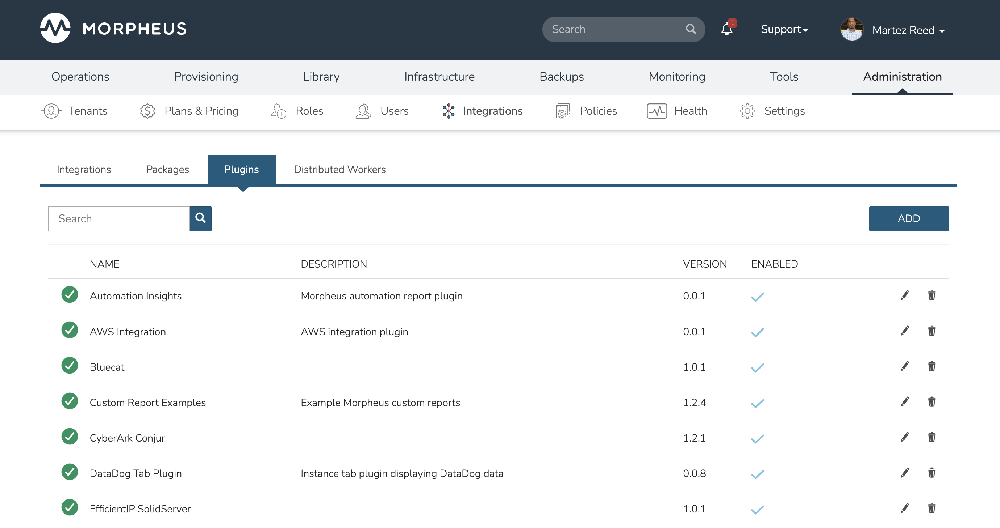
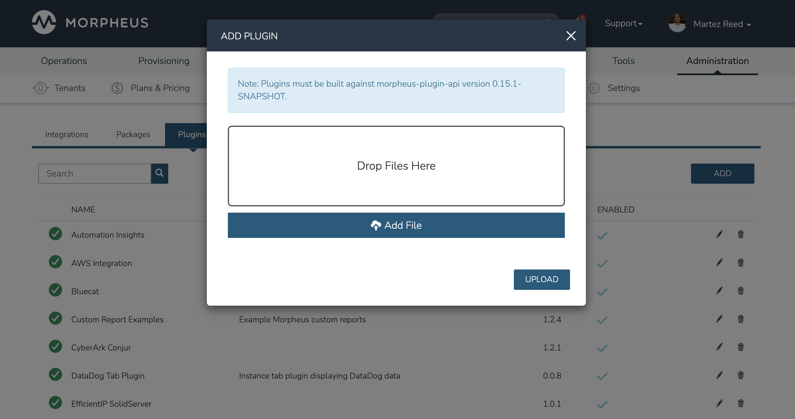
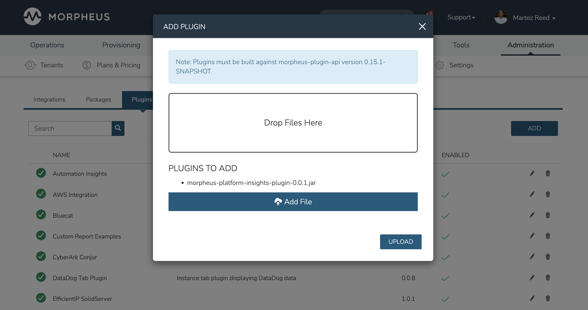
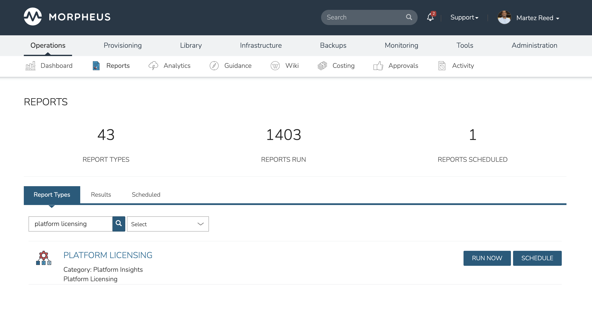
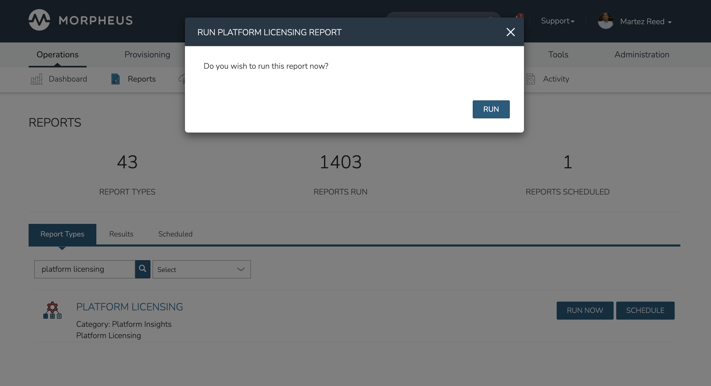
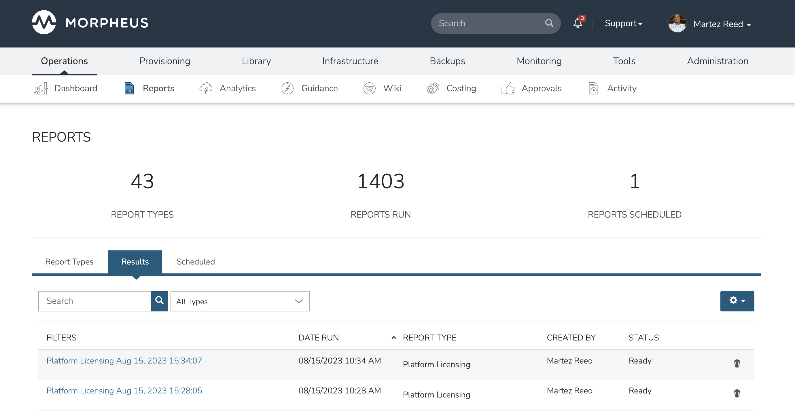
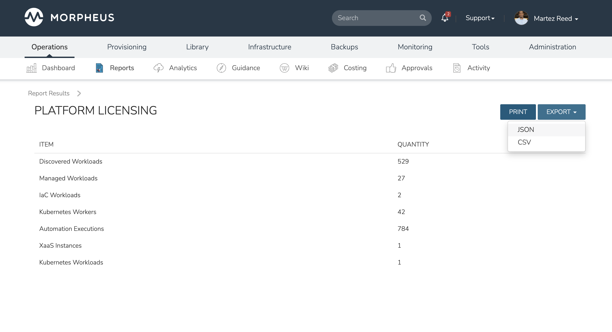

# Morpheus Platform Insights

Platform Insights analyzes the Morpheus platform to help enterprises better manage their Morpheus installation.

## Download Plugin
Download the JAR file for platform insights plugin that matches the version of the Morpheus platform that you are running.

* Morpheus 6.3.0 or higher: [https://github.com/martezr/morpheus-platform-insights/releases/tag/v2.0.0](https://github.com/martezr/morpheus-platform-insights/releases/tag/v2.0.0)
* Morpheus 6.2.7 or lower: [https://github.com/martezr/morpheus-platform-insights/releases/tag/v0.0.1](https://github.com/martezr/morpheus-platform-insights/releases/tag/v0.0.1)

## Installation

Browse to the **Administration** -> **Integrations** -> **Plugins** section in the Morpheus UI and click the **ADD** button to open the **ADD PLUGIN** modal.

Click the **Add File** button and select the downloaded JAR file.

Click the **UPLOAD** button to install the plugin.

The plugin should now be installed and ready for use.

## Running a Report

Browse to the **Operations** -> **Reports** -> **Report Types** section in the Morpheus UI. Scroll down to or search for **PLATFORM LICENSING** and click the **RUN NOW** button next to the report. 

Click the **RUN** button to confirm that you want to run the report.

Click on the generated report to access the report results.

Click the **EXPORT** drop-down from the report results page and select **JSON** to generate the JSON export file.

